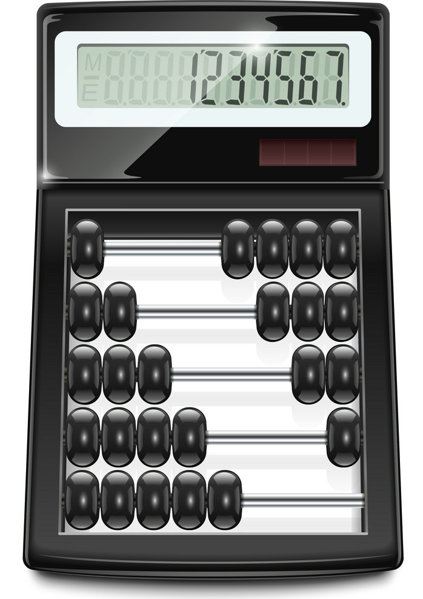

# L'exercise de calculator ( with vue Cli , vue js )
--------------



## Critères qualité
* Vue JS only => Zéro manipulation native DOM !!! 
* Framework Vuetify / Material Design
* Une calculatrice de base (opérations courantes + Modulo) 
* Librairie Lodash autorisée


## Project setup
```
npm install
```

### Compiles and hot-reloads for development
```
npm run serve
```

### Compiles and minifies for production
```
npm run build
```

### Run your tests
```
npm run test
```

### Lints and fixes files
```
npm run lint
```

### Customize configuration
See [Configuration Reference](https://cli.vuejs.org/config/).
